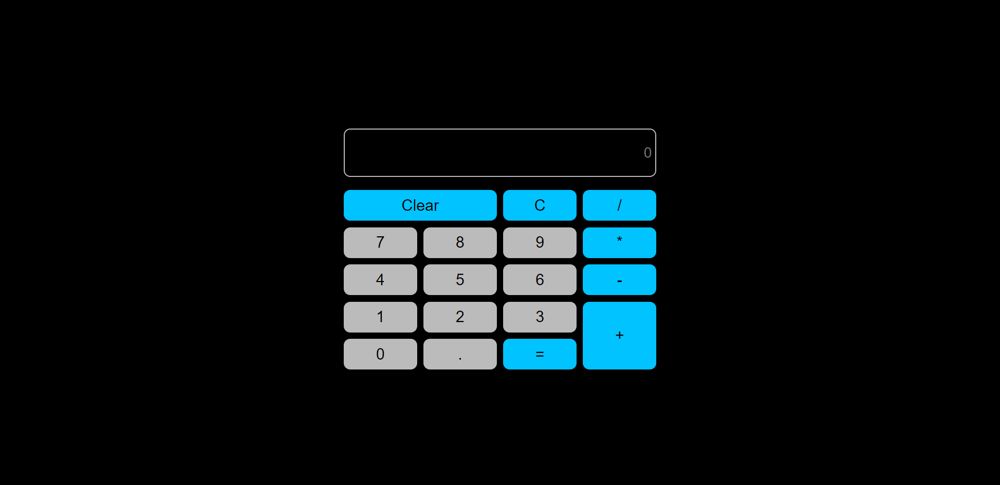

# Hey Welcome Buddy 👋

This is Rohit Madeshiya. Passionate to become a Full Stack Developer.

## Project Name : **Calculator In React !**

This is a React Based Project which i have created on stackblitz. I used some of hooks for state management and i have also use eval method to compute the numbers.

 

# 💻 Tech Stack Used :

  

 

### My Project is looking like :

### You can Check it Live on Below Link :

[Live Link !](https://react-calculator-using-grid.netlify.app/)
